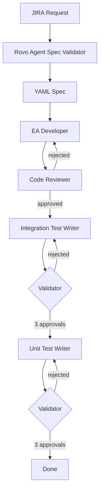

# Source EA Agent

The AI Agent to create Source External Adapters from YAML specifications.

## How It Works

The agent uses the [Claude Agent SDK](https://docs.anthropic.com/en/docs/claude-code/sdk) to orchestrate the following workflow:

```
JIRA Request → JIRA Rovo Agent Spec Validator → YAML Spec → Developer → Code Review → Integration Tests → Unit Tests → Done
```



| Phase                    | What Happens                                                                             |
| ------------------------ | ---------------------------------------------------------------------------------------- |
| **1. Development**       | Scaffolds EA with `yarn new`, implements transports/endpoints using framework components |
| **2. Code Review**       | Validates code quality; loops back to developer if rejected                              |
| **3. Integration Tests** | Writes tests, validates with 3 approval rounds                                           |
| **4. Unit Tests**        | Writes tests, validates with 3 approval rounds                                           |

## Quick Start

1. Get the YAML spec from JIRA (see [JIRA → YAML Spec](#jira--yaml-spec-ea-spec-validator) below)
2. Create a new branch and add the YAML file:

```bash
git checkout -b feat/OPDATA-123-my-adapter
cp my-spec.yaml ea-agent/requests/OPDATA-123-my-adapter.yaml
git add ea-agent/requests/OPDATA-123-my-adapter.yaml
git commit -m "feat: Add EA request for my-adapter"
git push origin feat/OPDATA-123-my-adapter
```

3. Open a PR — the GitHub Actions workflow runs automatically
4. Wait for the agent to generate the EA code and commit it to the PR
5. Review and merge

## JIRA → YAML Spec (EA Spec Validator)

Before the EA Agent runs, requirements must be validated and converted to YAML using the [EA Spec Validator](https://smartcontract-it.atlassian.net/wiki/x/M4Bhew) Rovo Agent.

### Setup the JIRA Ticket

1. Set ticket type = **Feed Deployment**
2. Set OP Product Type = **External Adapter**
3. Provide EA requirements in the **Description** section

### Trigger the Spec Validator

**Option 1: Label trigger (recommended)**

- Add `ai-spec-review` to the ticket's label field
- JIRA automation triggers the Rovo Agent
- YAML specs appear as a comment in 1-3 minutes

**Option 2: Rovo Chat**

- Navigate to the ticket (ensure URL ends with clean ticket ID, e.g., `/browse/OPDATA-3669`)
- Click "Ask Rovo" in the upper right
- Search for "EA Spec Validator"
- Click "Generate the YAML specs"

### Edit and Use the YAML

Once generated, click the edit icon on the comment to refine the YAML, then copy it to `ea-agent/requests/` in a new PR to trigger the EA Agent.

See [examples/yaml-spec-template.yaml.template](examples/yaml-spec-template.yaml.template) for the template and [examples/example-yaml-spec-OPDATA-4790.yaml](examples/example-yaml-spec-OPDATA-4790.yaml) for a complete example.

## GitHub Actions

The agent runs automatically via `.github/workflows/generate-ea.yml`.

### Required Secrets

| Secret                           | Description                                        |
| -------------------------------- | -------------------------------------------------- |
| `CC_GHA_GCP_SERVICE_ACCOUNT_KEY` | GCP service account credentials JSON for Vertex AI |
| `CC_GHA_GCP_PROJECT_ID`          | GCP project ID for Vertex AI                       |

### Trigger Options

1. **Add YAML to PR** — Push a YAML file to `ea-agent/requests/`
2. **Comment** — Type `/generate-ea` on any PR with a YAML file

### What Happens

1. Detects YAML in `ea-agent/requests/`
2. Runs `ea-agent/scripts/setup-ea-env.sh` to install deps and unplug framework
3. Runs all 4 phases
4. Commits generated code to PR

## How It Uses the EA Framework

The agent generates EAs using **[@chainlink/external-adapter-framework](https://www.npmjs.com/package/@chainlink/external-adapter-framework)**.

### Unplugging the Framework

This repo uses [Yarn PnP](https://yarnpkg.com/features/pnp) where packages are stored in compressed `.zip` files inside `.yarn/cache/`. AI agents cannot read zip contents directly.

In GitHub Actions, the setup script (`ea-agent/scripts/setup-ea-env.sh`) runs:

```bash
yarn unplug @chainlink/external-adapter-framework
```

This extracts the framework to disk:

```
.yarn/unplugged/@chainlink-external-adapter-framework-npm-*/
  node_modules/@chainlink/external-adapter-framework/
    ├── *.d.ts          # Type definitions the agent reads
    ├── transports/
    ├── adapter/
    └── ...
```

The EA Developer agent can then read the `.d.ts` files to understand available components and implement the adapter correctly.

### Scaffolding with `yarn new`

The EA Developer agent runs `yarn new source` to scaffold a new adapter package. This command:

1. Generates the package structure at `packages/sources/example-adapter/`
2. Creates boilerplate files (tsconfig, package.json, src/index.ts)
3. Agent then renames the folder to the requested adapter name
4. Runs `yarn new tsconfig` to register the package

### Generated Structure

```
packages/sources/<adapter-name>/
├── src/
│   ├── index.ts           # Adapter with expose()
│   ├── config/index.ts    # AdapterConfig
│   ├── endpoint/*.ts      # Endpoints
│   └── transport/*.ts     # Transports
├── test/
│   ├── integration/
│   └── unit/
└── test-payload.json
```

## Interactive Use

Reference agent prompts directly in Cursor with `@` mentions:

```
@ea_developer.md Scaffold an EA for packages/sources/my-adapter
```

| Agent           | File                      | Purpose              |
| --------------- | ------------------------- | -------------------- |
| Developer       | `@ea_developer.md`        | Scaffold new adapter |
| Reviewer        | `@ea_code_reviewer.md`    | Review code quality  |
| Test Writers    | `@ea_*_test_writer.md`    | Write tests          |
| Test Validators | `@ea_*_test_validator.md` | Validate tests       |

## How to Update Agent Behaviors

Agent behaviors are defined by system prompts in `.claude/agents/`. Edit these files to change how agents work:

| File                               | Controls                                                               |
| ---------------------------------- | ---------------------------------------------------------------------- |
| `ea_developer.md`                  | How EAs are scaffolded, framework component selection, coding patterns |
| `ea_code_reviewer.md`              | Code review criteria, what passes/fails review                         |
| `ea_integration_test_writer.md`    | Integration test patterns and structure                                |
| `ea_integration_test_validator.md` | Integration test validation criteria                                   |
| `ea_unit_test_writer.md`           | Unit test patterns and structure                                       |
| `ea_unit_test_validator.md`        | Unit test validation criteria                                          |

### Local Development

To test prompt changes locally before pushing:

**Prerequisites:**

1. Set up Claude Code in dev container — follow the [Claude Code Local Setup Guide](https://github.com/smartcontractkit/claude-code-local-artifacts)
2. Python 3.11+ with [uv](https://github.com/astral-sh/uv)

**Run locally (inside dev container):**

```bash
ea-agent/scripts/setup-ea-env.sh
cd ea-agent && uv sync
uv run python src/source_ea_agent.py requests/OPDATA-123-my-adapter.yaml
```

**Environment Variables:**

| Variable           | Default                    | Description                  |
| ------------------ | -------------------------- | ---------------------------- |
| `WORKFLOW_MODEL`   | `claude-opus-4-5@20251101` | Model to use                 |
| `VERBOSE_LOGGING`  | `true`                     | Log all agent messages       |
| `JSON_LOG_PATH`    | —                          | Path for streaming JSON logs |
| `SUMMARY_LOG_PATH` | —                          | Path for final summary JSON  |

### Tips

- Keep prompts focused and specific
- Add examples of good/bad patterns
- Reference existing EAs in `packages/sources/` as examples
- Test prompt changes locally before pushing to CI

## Project Structure

```
ea-agent/
├── src/source_ea_agent.py    # Main orchestrator
├── scripts/setup-ea-env.sh   # CI environment setup
├── examples/                 # YAML templates and examples
└── requests/                 # YAML requirement files (input)

.claude/agents/
├── ea_developer.md           # Development agent prompt
├── ea_code_reviewer.md       # Code review agent prompt
├── ea_integration_test_*.md  # Integration test agents
└── ea_unit_test_*.md         # Unit test agents
```
