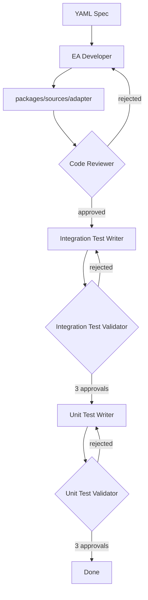

# Source EA Agent

AI-powered tool that scaffolds Chainlink Source External Adapters from YAML specifications.

**This agent is dedicated to developing Source EAs**

## What is This?

This agent automates the creation of Source External Adapters by orchestrating multiple AI agents through a four-phase workflow using the [Claude Agent SDK](https://docs.anthropic.com/en/docs/claude-code/sdk):

1. **Initialization** — Sets up the EA folder with `yarn new` non-interactive mode and generates adapter code (transports, endpoints, config)
2. **Code Review** — Validates code quality, framework usage, and production-readiness with an execute-validate loop
3. **Integration Testing** — Writes and validates integration tests with a write-validate loop (3 approvals required)
4. **Unit Testing** — Writes and validates unit tests with a write-validate loop (3 approvals required)

Each phase uses specialized agents with targeted system prompts. The testing phases use a writer agent followed by a validator agent, iterating until tests pass validation.



## Framework Utilization

The agent leverages the **Claude Agent SDK** (`claude_agent_sdk`) to orchestrate AI agents:

### Core SDK Features Used

| Feature | Usage |
|---------|-------|
| `query()` | Async generator for streaming agent responses |
| `ClaudeAgentOptions` | Configures model, system prompt, tools, and output format |
| `AssistantMessage` / `TextBlock` | Process agent responses |
| Structured Output | JSON schema-based output via Pydantic models |
| Permission Mode | `acceptEdits` for file modifications, read-only for validators |

### Agent Tool Access

| Agent Role | Tools |
|------------|-------|
| Writers/Developer | `Read`, `Write`, `Bash`, `List`, `GlobFileSearch` |
| Validators | `Read`, `Bash`, `List`, `GlobFileSearch` (read-only) |
| Code Reviewer | `Read`, `List`, `GlobFileSearch` (read-only) |

### Execute-Validate Loop Pattern

The `run_execute_validate_loop()` function implements an iterative refinement pattern:

1. **Executor** runs (writer or developer agent)
2. **Validator** reviews and returns structured `ValidationResult`
3. If rejected, feedback is passed back to executor for fixes
4. Loop continues until required approvals are met or max iterations reached

```python
class ValidationResult(BaseModel):
    approved: bool
    rationale: str  # Feedback if not approved
```

### Structured Output

Agents return typed results via Pydantic models and JSON schema:

```python
class InitializationResult(BaseModel):
    ea_package_path: str  # Path to generated EA package

result, _ = await run_agent(
    ...,
    output_schema=InitializationResult.model_json_schema(),
)
```

## Components

```
ea-agent/
├── src/
│   └── source_ea_agent.py     # Main orchestrator (4-phase workflow)
├── scripts/
│   └── setup-ea-env.sh        # Environment setup for CI
└── requests/                  # YAML requirement files (input specs)

.claude/agents/
├── ea_developer.md                 # System prompt: scaffold and develop the EA
├── ea_code_reviewer.md             # System prompt: review code quality
├── ea_integration_test_writer.md   # System prompt: write integration tests
├── ea_integration_test_validator.md # System prompt: validate integration tests
├── ea_unit_test_writer.md          # System prompt: write unit tests
└── ea_unit_test_validator.md       # System prompt: validate unit tests
```

## Usage

### Prerequisites

- Python 3.11+
- [uv](https://github.com/astral-sh/uv) package manager
- Claude Code CLI (`npm install -g @anthropic-ai/claude-code`)
- `ANTHROPIC_API_KEY` environment variable (or Vertex AI credentials)

### Run the Agent

```bash
cd ea-agent && uv sync
uv run --project ea-agent python ea-agent/src/source_ea_agent.py ea-agent/requests/OPDATA-999999-ea-name.yaml
```

The YAML file should contain the EA specification including:

- Adapter name and endpoints
- Request/response schemas
- API details (endpoint URLs, authentication)
- Transport type (HTTP, WebSocket, custom)

### Environment Variables

| Variable            | Default                    | Description                  |
| ------------------- | -------------------------- | ---------------------------- |
| `ANTHROPIC_API_KEY` | (required)                 | API key for Claude           |
| `WORKFLOW_MODEL`    | `claude-opus-4-5@20251101` | Model to use                 |
| `ENVIRONMENT`       | `development`              | Environment name             |
| `VERBOSE_LOGGING`   | `true`                     | Log all agent messages       |
| `JSON_LOG_PATH`     | —                          | Path for streaming JSON logs |
| `SUMMARY_LOG_PATH`  | —                          | Path for final summary JSON  |

### Output

The agent creates a new adapter package at:

```
packages/sources/<adapter-name>/
```

With complete source code, tests, and configuration ready for build and deployment.

## Interactive Use in Cursor

Reference the agent prompts in `.claude/agents/` directly in Cursor chat using `@` mentions:

| Agent                      | File                                | Use Case                                 |
| -------------------------- | ----------------------------------- | ---------------------------------------- |
| EA Developer               | `@ea_developer.md`                  | Scaffold a new adapter from requirements |
| Code Reviewer              | `@ea_code_reviewer.md`              | Review EA code quality                   |
| Integration Test Writer    | `@ea_integration_test_writer.md`    | Write integration tests for an adapter   |
| Integration Test Validator | `@ea_integration_test_validator.md` | Review and validate integration tests    |
| Unit Test Writer           | `@ea_unit_test_writer.md`           | Write unit tests for business logic      |
| Unit Test Validator        | `@ea_unit_test_validator.md`        | Review and validate unit tests           |

### Example

```
@ea_developer.md Initialize the EA project for packages/sources/my-adapter
```

## GitHub Actions Workflow

The agent can be triggered automatically via GitHub Actions (`.github/workflows/generate-ea.yml`).

### Triggers

1. **PR with YAML file** — Open a PR that adds a YAML file to `ea-agent/requests/`
2. **Comment command** — Comment `/generate-ea` on any PR with a YAML file

### What It Does

1. Detects the YAML file in `ea-agent/requests/`
2. Sets up environment (Python, Node.js, Claude Code CLI)
3. Runs the EA scaffolding agent through all 4 phases
4. Commits generated code back to the PR
5. Updates PR description with status and review checklist

### Example

```bash
# Create a branch with your YAML spec
git checkout -b feat/OPDATA-123-my-adapter
cp my-spec.yaml ea-agent/requests/OPDATA-123-my-adapter.yaml
git add ea-agent/requests/OPDATA-123-my-adapter.yaml
git commit -m "feat: Add EA request for my-adapter"
git push origin feat/OPDATA-123-my-adapter

# Open a PR — the workflow runs automatically
```

Or trigger manually on an existing PR:

```
/generate-ea
```

## Workflow Phases Detail

### Phase 1: Initialization

The EA Developer agent:
- Runs `yarn new source` to scaffold the package
- Renames from `example-adapter` to the requested name
- Implements transports, endpoints, and config based on YAML spec
- Uses the EA framework at `.yarn/unplugged/@chainlink-external-adapter-framework-npm-*`

### Phase 2: Code Review

The Code Reviewer agent validates:
- Correct framework component selection (transport, endpoint, adapter types)
- Code quality (DRY, KISS, single responsibility)
- Type safety and precision handling
- Configuration and error handling

If rejected, the EA Developer fixes issues and re-submits.

### Phase 3: Integration Testing

The Integration Test Writer:
- Generates integration tests using framework testing utilities
- Mocks external API responses
- Tests endpoint behavior and error handling

The Integration Test Validator:
- Reviews test quality and coverage
- Runs tests to verify they pass
- Requires 3 consecutive approvals

### Phase 4: Unit Testing

The Unit Test Writer:
- Generates unit tests for business logic
- Tests transport parsing, data transformations
- Focuses on isolated function testing

The Unit Test Validator:
- Reviews test quality
- Runs tests to verify they pass
- Requires 3 consecutive approvals
