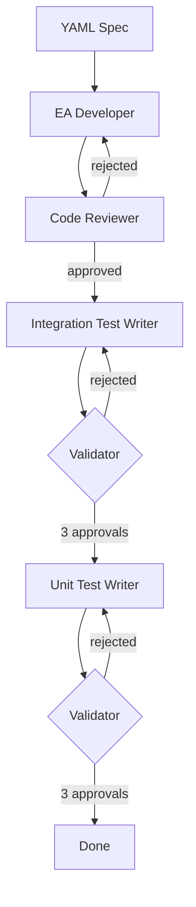

# Source EA Agent

The AI Agent to create Source External Adapters from YAML specifications.

## How It Works

The agent uses the [Claude Agent SDK](https://docs.anthropic.com/en/docs/claude-code/sdk) to orchestrate a 4-phase workflow:

```
YAML Spec → Developer → Code Review → Integration Tests → Unit Tests → Done
```



| Phase | What Happens |
|-------|--------------|
| **1. Development** | Scaffolds EA with `yarn new`, implements transports/endpoints using framework components |
| **2. Code Review** | Validates code quality; loops back to developer if rejected |
| **3. Integration Tests** | Writes tests, validates with 3 approval rounds |
| **4. Unit Tests** | Writes tests, validates with 3 approval rounds |

## Using the Framework

The agent generates EAs using **[@chainlink/external-adapter-framework](https://www.npmjs.com/package/@chainlink/external-adapter-framework)**.

### Why Unplugged?

This repo uses [Yarn PnP](https://yarnpkg.com/features/pnp) where packages are stored in compressed `.zip` files inside `.yarn/cache/`. AI agents cannot read zip contents directly.

The framework package is configured as "unplugged" in `.yarnrc.yml`, which extracts it to disk:

```
.yarn/unplugged/@chainlink-external-adapter-framework-npm-*/
  node_modules/@chainlink/external-adapter-framework/
    ├── *.d.ts          # Type definitions the agent reads
    ├── transports/
    ├── adapter/
    └── ...
```

This allows the EA Developer agent to read the framework's `.d.ts` files directly, understand available components, and implement the adapter correctly.

### Generated Structure

```
packages/sources/<adapter-name>/
├── src/
│   ├── index.ts           # Adapter with expose()
│   ├── config/index.ts    # AdapterConfig
│   ├── endpoint/*.ts      # Endpoints
│   └── transport/*.ts     # Transports
├── test/
│   ├── integration/
│   └── unit/
└── test-payload.json
```

## Quick Start

### Prerequisites

- Python 3.11+ with [uv](https://github.com/astral-sh/uv)
- Claude Code CLI: `npm install -g @anthropic-ai/claude-code`
- `ANTHROPIC_API_KEY` environment variable

### Run

```bash
cd ea-agent && uv sync
uv run python src/source_ea_agent.py requests/OPDATA-123-my-adapter.yaml
```

### Environment Variables

| Variable | Default | Description |
|----------|---------|-------------|
| `ANTHROPIC_API_KEY` | required | Claude API key |
| `WORKFLOW_MODEL` | `claude-opus-4-5@20251101` | Model to use |
| `VERBOSE_LOGGING` | `true` | Log all messages |

## GitHub Actions

The agent runs automatically via `.github/workflows/generate-ea.yml`.

### Trigger Options

1. **Add YAML to PR** — Push a YAML file to `ea-agent/requests/`
2. **Comment** — Type `/generate-ea` on any PR with a YAML file

### What Happens

1. Detects YAML in `ea-agent/requests/`
2. Runs all 4 phases
3. Commits generated code to PR

## Project Structure

```
ea-agent/
├── src/source_ea_agent.py    # Main orchestrator
├── scripts/setup-ea-env.sh   # CI environment setup
└── requests/                 # YAML requirement files

.claude/agents/
├── ea_developer.md           # Development agent prompt
├── ea_code_reviewer.md       # Code review agent prompt
├── ea_integration_test_*.md  # Integration test agents
└── ea_unit_test_*.md         # Unit test agents
```

## Interactive Use

Reference agent prompts directly in Cursor with `@` mentions:

```
@ea_developer.md Scaffold an EA for packages/sources/my-adapter
```

| Agent | File | Purpose |
|-------|------|---------|
| Developer | `@ea_developer.md` | Scaffold new adapter |
| Reviewer | `@ea_code_reviewer.md` | Review code quality |
| Test Writers | `@ea_*_test_writer.md` | Write tests |
| Test Validators | `@ea_*_test_validator.md` | Validate tests |
