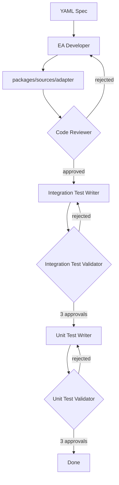

# Source EA Agent

AI-powered tool that scaffolds Chainlink Source External Adapters from YAML specifications.

**This agent is dedicated to developing Source EAs**

## What is This?

This agent automates the creation of Source External Adapters by orchestrating multiple AI agents through a four-phase workflow using the [Claude Agent SDK](https://docs.anthropic.com/en/docs/claude-code/sdk):

1. **Initialization** — Sets up the EA folder with `yarn new` non-interactive mode and generates adapter code (transports, endpoints, config)
2. **Code Review** — Validates code quality, framework usage, and production-readiness with an execute-validate loop
3. **Integration Testing** — Writes and validates integration tests with a write-validate loop (3 approvals required)
4. **Unit Testing** — Writes and validates unit tests with a write-validate loop (3 approvals required)

Each phase uses specialized agents with targeted system prompts. The testing phases use a writer agent followed by a validator agent, iterating until tests pass validation.



## Chainlink External Adapter Framework

The agent generates EAs using the **[@chainlink/external-adapter-framework](https://www.npmjs.com/package/@chainlink/external-adapter-framework)** — a TypeScript framework that provides standardized components for building production-ready adapters.

The framework source is available at:
```
.yarn/unplugged/@chainlink-external-adapter-framework-npm-*/node_modules/@chainlink/external-adapter-framework/
```

### How the Agent Uses the Framework

The EA Developer agent reads the framework's `.d.ts` type definitions to understand available components and their interfaces. It then selects the most appropriate components based on the YAML requirements:

### Transports

Transports handle data fetching from external APIs:

| Transport | Use Case | Key Methods |
|-----------|----------|-------------|
| `HttpTransport` | REST API requests | `prepareRequests()`, `parseResponse()` |
| `WebSocketTransport` | Real-time streaming data | `url`, `handlers.message`, `builders` |
| `SseTransport` | Server-Sent Events | Similar to WebSocket |

### Endpoints

Endpoints define the adapter's API surface:

| Endpoint Type | Use Case |
|---------------|----------|
| `AdapterEndpoint` | Generic endpoints |
| `PriceEndpoint` / `CryptoPriceEndpoint` / `ForexPriceEndpoint` | Price feeds with base/quote params |
| `LwbaEndpoint` | Lightweight bid/ask (bid, mid, ask) |
| `StockEndpoint` | Stock data feeds |
| `MarketStatusEndpoint` | Market open/closed status |
| PoR endpoints | Proof of Reserves |

### Adapters

The main adapter class that ties everything together:

| Adapter Type | Use Case |
|--------------|----------|
| `Adapter` | Generic adapter |
| `PriceAdapter` | Price feeds with includes support |
| `PoRAdapter` | Proof of Reserves |

### Input Parameters & Config

| Component | Purpose |
|-----------|---------|
| `InputParameters` | Define typed input params with validation |
| `EmptyInputParameters` | When no input params needed |
| `AdapterConfig` | Environment-based configuration |

### Response Types

| Type | Purpose |
|------|---------|
| `SingleNumberResultResponse` | Standard numeric response |
| `AdapterResponse` | Full response structure |
| `ProviderResult` | Provider data with timestamps |

### Error Handling

| Error Type | Use Case |
|------------|----------|
| `AdapterError` | Base error class |
| `AdapterInputError` | Input validation failures |
| `AdapterRateLimitError` | Rate limit exceeded |
| `AdapterDataProviderError` | Provider failures |

### Example: Generated EA Structure

```
packages/sources/<adapter-name>/
├── src/
│   ├── index.ts           # Adapter definition with expose()
│   ├── config/
│   │   └── index.ts       # AdapterConfig with env settings
│   ├── endpoint/
│   │   └── price.ts       # PriceEndpoint with InputParameters
│   └── transport/
│       └── price.ts       # HttpTransport with prepareRequests/parseResponse
├── test/
│   ├── integration/       # Integration tests
│   └── unit/              # Unit tests
└── test-payload.json      # Soak test payload
```

## Components

```
ea-agent/
├── src/
│   └── source_ea_agent.py     # Main orchestrator (4-phase workflow)
├── scripts/
│   └── setup-ea-env.sh        # Environment setup for CI
└── requests/                  # YAML requirement files (input specs)

.claude/agents/
├── ea_developer.md                 # System prompt: scaffold and develop the EA
├── ea_code_reviewer.md             # System prompt: review code quality
├── ea_integration_test_writer.md   # System prompt: write integration tests
├── ea_integration_test_validator.md # System prompt: validate integration tests
├── ea_unit_test_writer.md          # System prompt: write unit tests
└── ea_unit_test_validator.md       # System prompt: validate unit tests
```

## Usage

### Prerequisites

- Python 3.11+
- [uv](https://github.com/astral-sh/uv) package manager
- Claude Code CLI (`npm install -g @anthropic-ai/claude-code`)
- `ANTHROPIC_API_KEY` environment variable (or Vertex AI credentials)

### Run the Agent

```bash
cd ea-agent && uv sync
uv run --project ea-agent python ea-agent/src/source_ea_agent.py ea-agent/requests/OPDATA-999999-ea-name.yaml
```

The YAML file should contain the EA specification including:

- Adapter name and endpoints
- Request/response schemas
- API details (endpoint URLs, authentication)
- Transport type (HTTP, WebSocket, custom)

### Environment Variables

| Variable            | Default                    | Description                  |
| ------------------- | -------------------------- | ---------------------------- |
| `ANTHROPIC_API_KEY` | (required)                 | API key for Claude           |
| `WORKFLOW_MODEL`    | `claude-opus-4-5@20251101` | Model to use                 |
| `ENVIRONMENT`       | `development`              | Environment name             |
| `VERBOSE_LOGGING`   | `true`                     | Log all agent messages       |
| `JSON_LOG_PATH`     | —                          | Path for streaming JSON logs |
| `SUMMARY_LOG_PATH`  | —                          | Path for final summary JSON  |

### Output

The agent creates a new adapter package at:

```
packages/sources/<adapter-name>/
```

With complete source code, tests, and configuration ready for build and deployment.

## Interactive Use in Cursor

Reference the agent prompts in `.claude/agents/` directly in Cursor chat using `@` mentions:

| Agent                      | File                                | Use Case                                 |
| -------------------------- | ----------------------------------- | ---------------------------------------- |
| EA Developer               | `@ea_developer.md`                  | Scaffold a new adapter from requirements |
| Code Reviewer              | `@ea_code_reviewer.md`              | Review EA code quality                   |
| Integration Test Writer    | `@ea_integration_test_writer.md`    | Write integration tests for an adapter   |
| Integration Test Validator | `@ea_integration_test_validator.md` | Review and validate integration tests    |
| Unit Test Writer           | `@ea_unit_test_writer.md`           | Write unit tests for business logic      |
| Unit Test Validator        | `@ea_unit_test_validator.md`        | Review and validate unit tests           |

### Example

```
@ea_developer.md Initialize the EA project for packages/sources/my-adapter
```

## GitHub Actions Workflow

The agent can be triggered automatically via GitHub Actions (`.github/workflows/generate-ea.yml`).

### Triggers

1. **PR with YAML file** — Open a PR that adds a YAML file to `ea-agent/requests/`
2. **Comment command** — Comment `/generate-ea` on any PR with a YAML file

### What It Does

1. Detects the YAML file in `ea-agent/requests/`
2. Sets up environment (Python, Node.js, Claude Code CLI)
3. Runs the EA scaffolding agent through all 4 phases
4. Commits generated code back to the PR
5. Updates PR description with status and review checklist

### Example

```bash
# Create a branch with your YAML spec
git checkout -b feat/OPDATA-123-my-adapter
cp my-spec.yaml ea-agent/requests/OPDATA-123-my-adapter.yaml
git add ea-agent/requests/OPDATA-123-my-adapter.yaml
git commit -m "feat: Add EA request for my-adapter"
git push origin feat/OPDATA-123-my-adapter

# Open a PR — the workflow runs automatically
```

Or trigger manually on an existing PR:

```
/generate-ea
```

## Workflow Phases Detail

### Phase 1: Initialization

The EA Developer agent:
- Runs `yarn new source` to scaffold the package structure
- Renames from `example-adapter` to the requested name
- Reads the framework `.d.ts` files to understand component interfaces
- Selects appropriate framework components based on YAML requirements:
  - **Transport**: `HttpTransport` for REST, `WebSocketTransport` for streaming
  - **Endpoint**: `PriceEndpoint` for price feeds, `AdapterEndpoint` for generic
  - **Adapter**: `PriceAdapter` or `Adapter` based on endpoint types
- Implements `prepareRequests()` and `parseResponse()` for data fetching
- Configures `AdapterConfig` with required environment variables

### Phase 2: Code Review

The Code Reviewer agent validates:
- Correct framework component selection (transport, endpoint, adapter types)
- Code quality (DRY, KISS, single responsibility)
- Type safety and precision handling
- Configuration and error handling

If rejected, the EA Developer fixes issues and re-submits.

### Phase 3: Integration Testing

The Integration Test Writer:
- Generates integration tests using framework testing utilities
- Mocks external API responses
- Tests endpoint behavior and error handling

The Integration Test Validator:
- Reviews test quality and coverage
- Runs tests to verify they pass
- Requires 3 consecutive approvals

### Phase 4: Unit Testing

The Unit Test Writer:
- Generates unit tests for business logic
- Tests transport parsing, data transformations
- Focuses on isolated function testing

The Unit Test Validator:
- Reviews test quality
- Runs tests to verify they pass
- Requires 3 consecutive approvals
