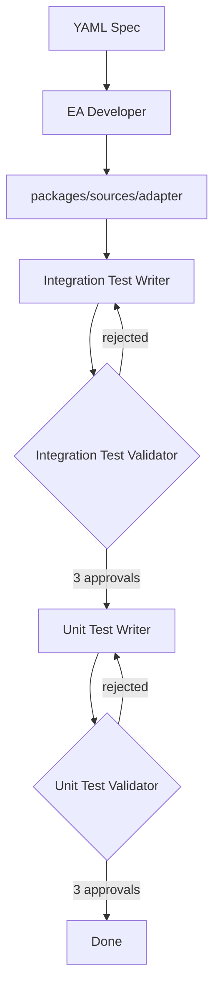

# Source EA Agent

AI-powered tool that scaffolds Chainlink Source External Adapters from YAML specifications.

**This agent is dedicated to developing Source EAs**

## What is This?

This agent automates the creation of Source External Adapters by orchestrating multiple AI agents through a three-phase workflow:

1. **Setup & Develop** — Setups the EA folder with`yarn new` non-interactive mode and modifies & generates adapter code (transports, endpoints, config)
2. **Integration Testing** — Writes and validates integration tests with a write-validate loop
3. **Unit Testing** — Writes and validates unit tests with a write-validate loop

Each testing phase uses a writer agent followed by a validator agent, iterating until tests pass validation (up to 3 approvals required).



## Components

```
ea-agent/
├── src/
│   └── source_ea_agent.py # Main orchestrator for Source EAs (runs the 3-phase workflow)
└── requests/              # YAML requirement files (input specs)

.claude/agents/
├── ea_developer.md              # System prompt: setup and develop the EA
├── ea_integration_test_writer.md    # System prompt: writes integration tests
├── ea_integration_test_validator.md # System prompt: validates integration tests
├── ea_unit_test_writer.md           # System prompt: writes unit tests
└── ea_unit_test_validator.md        # System prompt: validates unit tests
```

## Usage

### Prerequisites

- Python 3.11+
- [uv](https://github.com/astral-sh/uv) package manager
- `ANTHROPIC_API_KEY` environment variable

### Run the Agent

```bash
uv run ea-agent/src/source_ea_agent.py ea-agent/requests/OPDATA-999999-ea-name.yaml
```

The YAML file should contain the EA specification including:

- Adapter name and endpoints
- Request/response schemas
- API details (endpoint URLs, authentication)
- Transport type (HTTP, WebSocket, custom)

### Environment Variables

| Variable            | Default                    | Description                  |
| ------------------- | -------------------------- | ---------------------------- |
| `ANTHROPIC_API_KEY` | (required)                 | API key for Claude           |
| `WORKFLOW_MODEL`    | `claude-opus-4-5@20251101` | Model to use                 |
| `VERBOSE_LOGGING`   | `true`                     | Log all agent messages       |
| `JSON_LOG_PATH`     | —                          | Path for streaming JSON logs |
| `SUMMARY_LOG_PATH`  | —                          | Path for final summary JSON  |

### Output

The agent creates a new adapter package at:

```
packages/sources/<adapter-name>/
```

With complete source code, tests, and configuration ready for build and deployment.

## Interactive Use in Cursor

Reference the agent prompts in `.claude/agents/` directly in Cursor chat using `@` mentions:

| Agent                      | File                                | Use Case                                 |
| -------------------------- | ----------------------------------- | ---------------------------------------- |
| EA Developer               | `@ea_developer.md`                  | Scaffold a new adapter from requirements |
| Integration Test Writer    | `@ea_integration_test_writer.md`    | Write integration tests for an adapter   |
| Integration Test Validator | `@ea_integration_test_validator.md` | Review and validate integration tests    |
| Unit Test Writer           | `@ea_unit_test_writer.md`           | Write unit tests for business logic      |
| Unit Test Validator        | `@ea_unit_test_validator.md`        | Review and validate unit tests           |

### Example

```
@ea_developer.md Initialize the EA project for packages/sources/my-adapter
```

## GitHub Actions Workflow

The agent can be triggered automatically via GitHub Actions (`.github/workflows/generate-ea.yml`).

### Triggers

1. **PR with YAML file** — Open a PR that adds a YAML file to `ea-agent/requests/`
2. **Comment command** — Comment `/generate-ea` on any PR with a YAML file

### What It Does

1. Detects the YAML file in `ea-agent/requests/`
2. Runs the EA scaffolding agent
3. Commits generated code back to the PR
4. Updates PR description with status and review checklist

### Example

```bash
# Create a branch with your YAML spec
git checkout -b feat/OPDATA-123-my-adapter
cp my-spec.yaml ea-agent/requests/OPDATA-123-my-adapter.yaml
git add ea-agent/requests/OPDATA-123-my-adapter.yaml
git commit -m "feat: Add EA request for my-adapter"
git push origin feat/OPDATA-123-my-adapter

# Open a PR — the workflow runs automatically
```

Or trigger manually on an existing PR:

```
/generate-ea
```
